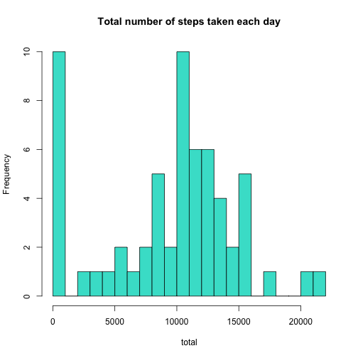
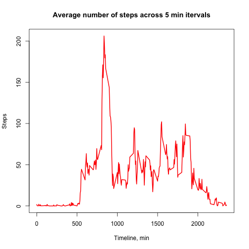
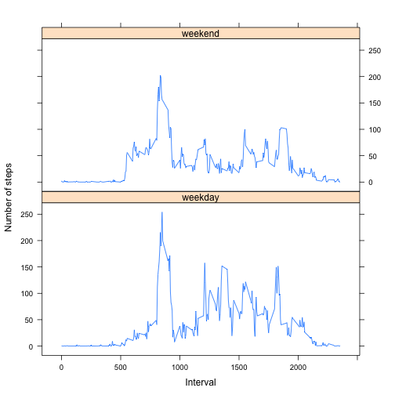

## Loading and preprocessing the data  

1. Load the data


```r
data<- read.csv("./activity.csv", sep =",")
```

2. Convert date from factor to Date format


```r
data$date<- as.Date(data$date)
```

## What is mean total number of steps taken per day?  

1. Calculate the total number of steps taken per day  


```r
total<- tapply(data$steps, data$date, sum, na.rm= TRUE)
```

2. Make a histogram of the total number of steps taken each day  


```r
hist(total, main = "Total number of steps taken each day", col = "turquoise", breaks =20)
```



3. Calculate and report the mean and median of the total number of steps taken per day  


```r
# library "stringr"" needed for function "paste":
library(stringr)

print(paste("Mean of the total number of steps taken per day:",mean(total)))
```

```
## [1] "Mean of the total number of steps taken per day: 9354.22950819672"
```

```r
print(paste("Median of the total number of steps taken per day:",median(total)))
```

```
## [1] "Median of the total number of steps taken per day: 10395"
```

## What is the average daily activity pattern?  

1. Make a time series plot (i.e. \color{red}{\verb|type = "l"|}type="l") of the 5-minute interval (x-axis) and the average number of steps taken, averaged across all days (y-axis)  


```r
#get average number of steps for each interval:
average<- tapply(data$steps, data$interval, mean, na.rm= TRUE)

#convert intervals from character to integer class:
intervals<- as.integer(names(average))

#make a plot for average number of steps acros 5 min intervals:
plot(intervals,average, type="l", ylab = "Steps", xlab = "Timeline, min", main="Average number of steps across 5 min itervals", lwd = 2, col = "red")
```



2. Which 5-minute interval, on average across all the days in the dataset, contains the maximum number of steps?  


```r
print(paste("Interval with maximum number of steps is :", intervals[which.max(average)], "min"))
```

```
## [1] "Interval with maximum number of steps is : 835 min"
```

## Imputing missing values

1. Calculate and report the total number of missing values in the dataset (i.e. the total number of rows with \color{red}{\verb|NA|}NAs)


```r
print(paste( "Total number of missing values in the dataset is:", sum(is.na(data))))
```

```
## [1] "Total number of missing values in the dataset is: 2304"
```

2. Devise a strategy for filling in all of the missing values in the dataset. The strategy does not need to be sophisticated. For example, you could use the mean/median for that day, or the mean for that 5-minute interval, etc.  


```r
# create array to store new values:
new_values<- data$steps 

#loop over dataset:
for (i in 1:length(data$steps)){
    # if steps is equal to NA, change it to average value across existing 5 min intervals:
    if (is.na(data$steps[i])==TRUE){
        new_values[i] <- average[(names(average) == data$interval[i])]
    }    
} 
```

3. Create a new dataset that is equal to the original dataset but with the missing data filled in.


```r
#library "data.table" needed for function "copy":
library(data.table)

data_new<- copy(data)
data_new$steps<- new_values
```

4. Make a histogram of the total number of steps taken each day and Calculate and report the mean and median total number of steps taken per day. Do these values differ from the estimates from the first part of the assignment? What is the impact of imputing missing data on the estimates of the total daily number of steps?


```r
# Calculate the total number of steps taken per day for new dataset: 
total_new<- tapply(data_new$steps, data_new$date, sum)

#Make a histogram of the total number of steps taken each day:
hist(total_new, main = "Total number of steps taken each day", col = "turquoise", breaks =20)
```


```r
#Calculate and report mean and median:
print(paste("Mean of the total number of steps taken per day:",mean(total_new)))
```

```
## [1] "Mean of the total number of steps taken per day: 10766.1886792453"
```

```r
print(paste("Median of the total number of steps taken per day:",median(total_new)))
```

```
## [1] "Median of the total number of steps taken per day: 10766.1886792453"
```

## Are there differences in activity patterns between weekdays and weekends?

1. Create a new factor variable in the dataset with two levels - "weekday" and "weekend" indicating whether a given date is a weekday or weekend day.


```r
data_new$wd <- wday(data_new$date)
for (i in 1:length(data_new$steps)){
    if (data_new$wd[i]==6|data_new$wd[i]==7){
        data_new$wd[i] <- "weekday"
    }
    else {
        data_new$wd[i] <- "weekend"
    }
}
```

2. Make a panel plot containing a time series plot (i.e. \color{red}{\verb|type = "l"|}type="l") of the 5-minute interval (x-axis) and the average number of steps taken, averaged across all weekday days or weekend days (y-axis). 


```r
#group data by intervals and week/weekend days and average it:
data_grouped<- aggregate(data_new$steps, by = list(x= data_new$interval, y= data_new$wd), FUN= mean)

#rename columns after grouping to old names:
colnames(data_grouped)<- c("interval", "wd", "steps")

#open "lattice"" library:
library(lattice)

#Make a panel plot:
xyplot(data_grouped$steps ~ data_grouped$interval | data_grouped$wd, type = "l", layout = c(1,2), xlab = "Interval", ylab = "Number of steps")
```


